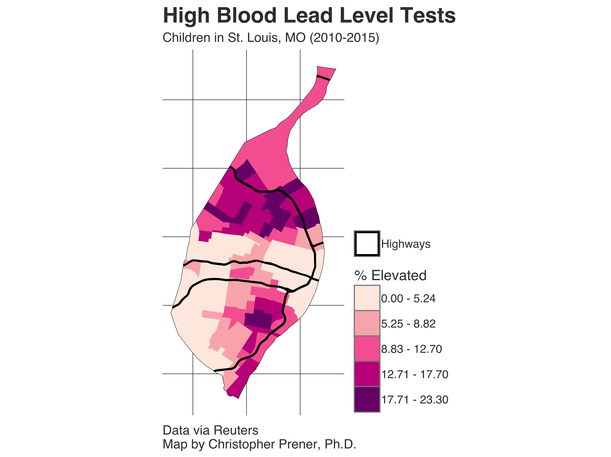
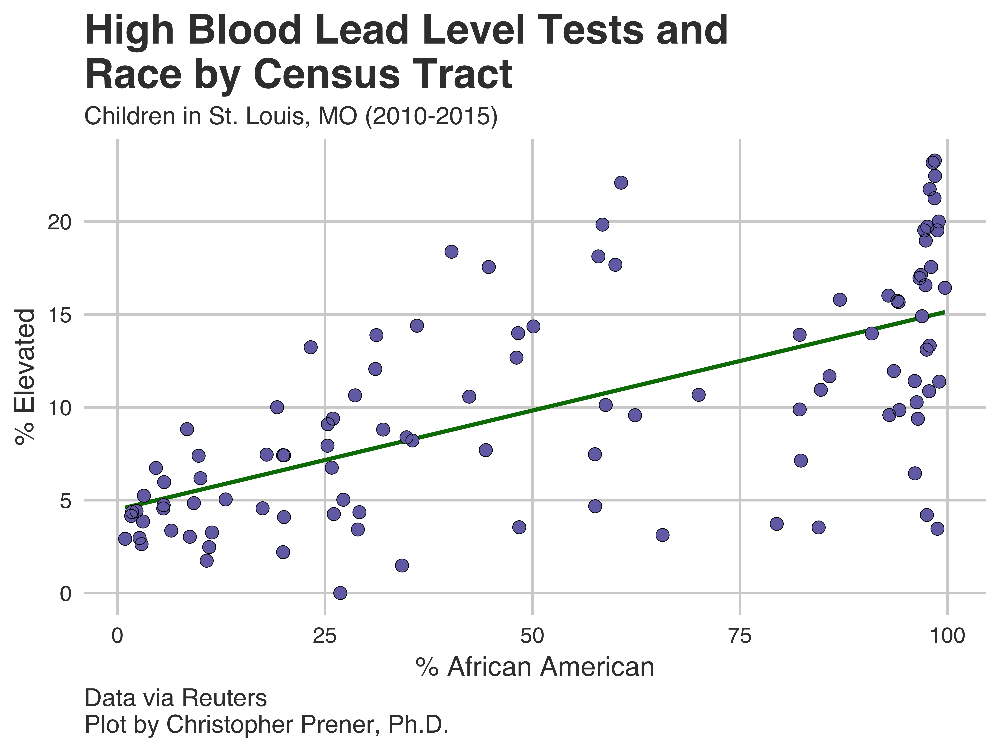

# STL_HEALTH_Lead

### Abstract
This repository contains a map image of census tracts in St. Louis, Missouri, colored by the estimated number of high blood lead tests over the 2010-2015 period. The repository also contains a variety of plots describing high lead exposure in St. Louis and two demographic correlates - race and poverty.

Unlike adults, who tend to be exposed to lead in the workplace, childrens' exposures tend to be enviornmental through their homes or schools. The CDC's "level of concern" for a high test is [5 micrograms per deciliter](https://www.cdc.gov/nceh/lead/acclpp/lead_levels_in_children_fact_sheet.pdf) of lead in blood.

These data were obtained from Reuters' reporting on this topic. I use this map on the first day of class for introducing major themes, for teaching about race and health, and for discussing urban health issues.

### Preview

### Related Readings
* [Unsafe at Any Level](https://www.reuters.com/investigates/special-report/usa-lead-testing/) - original Reuters' article
* [Sampson and Winter 2016](https://www.cambridge.org/core/journals/du-bois-review-social-science-research-on-race/article/racial-ecology-of-lead-poisoning/F39AF4724258606DCC1CDA369DC08707)

### Citing These Images
This repository is associated with a [Digital Object Identifier](https://en.wikipedia.org/wiki/Digital_object_identifier) (or DOI). Please include the DOI when citing these images. You can find pre-formatted citations and a BibTeX entry, among other citation resources, on the associated [Zenodo release page]().

## About SOC 1120: Introduction to Sociology - Diversity and Health Emphasis
### Course Description
Sociology is the empirical study of group and social life. Like all introductory courses, SOC 1120 provides an overview of the basic topics that sociologists regularly engage with under this broad definition. These include the theories used to hypothesize about the social world, the methods used to explore it, and the most common social phenomena we study. For each topic we discuss, specific examples from the sociology of medicine, the sociology of health and illness, and social epidemiology are used. The course meets Saint Louis University’s Cultural Diversity in the U.S. and Social Science core curriculum requirements. More details are available on the [course website](https://slu-soc1120.github.io).

### About Christopher Prener, Ph.D.
Chris is an urban and medical sociologist with an interest in mixed methods research designs that incorporate spatial data. His dissertation examined the effect of neighborhood context and conditions on emergency medical services work, particularly with patients who have mental illnesses or substance use disorders. He is also part of a research team examining the effects of literacy on mental health service use and recovery, and his student research team is documenting the effects of systemic street closures in St. Louis. He is an Assistant Professor in the Department of Sociology and Anthropology at Saint Louis University. More details are available at [his website](https://chris-prener.github.io) and he can be contacted at [chris.prener@slu.edu](mailto:chris.prener@slu.edu).

### About Saint Louis University 
Founded in 1818, [Saint Louis University](http://wwww.slu.edu) is one of the nation’s oldest and most prestigious Catholic institutions. Rooted in Jesuit values and its pioneering history as the first university west of the Mississippi River, SLU offers nearly 13,000 students a rigorous, transformative education of the whole person. At the core of the University’s diverse community of scholars is SLU’s service-focused mission, which challenges and prepares students to make the world a better, more just place.
